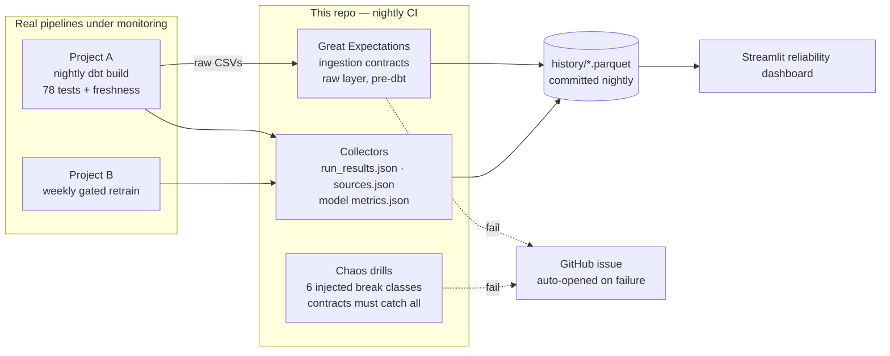

# ✅ Data Reliability & Automation Suite

**Live dashboard:** [shivanshu-analytics.streamlit.app/Data_Quality_Monitor](https://shivanshu-analytics.streamlit.app/Data_Quality_Monitor) · **Portfolio:** [shivanshu-analytics.vercel.app](https://shivanshu-analytics.vercel.app)


The observability layer for my data platform. It monitors two **real,
running pipelines** — the [analytics platform](https://github.com/Shivay815/ecom-analytics-platform)'s
nightly dbt build and the [churn model](https://github.com/Shivay815/churn-insights-app)'s
weekly gated retrain — and makes silent data failures structurally impossible:
every failure mode either fails CI loudly or lands as an alert.

## 1. Business Problem

The #1 pain of every data team: *"the dashboard has been wrong for two weeks
and nobody noticed."* Data can fail silently at three layers — bad raw
extracts, broken transformation logic, degraded models. Each layer needs its
own detection, and detection nobody looks at needs alerting.

## 2. System Architecture



**Validation lives at three layers, deliberately:**

| Layer | Tool | Catches |
|---|---|---|
| Ingestion (pre-dbt) | Great Expectations contracts (this repo) | Truncated extracts, null/duplicate keys, enum drift, currency-unit bugs |
| Transformation | dbt tests in Project A (78, collected here) | Broken joins, grain violations, bad business logic |
| Model | Project B's CI quality gate (metrics collected here) | Regressed retrains, drifted evaluation |

## 3. The Chaos Drills (how the "catches breaks" claim is measured)

`tests/test_chaos.py` injects six realistic break classes into clean data and
asserts the contracts refuse **every one**: null primary keys, duplicate
primary keys, unknown enum values, row-count collapse (silent truncation),
negative prices, and absurd outliers (currency-unit bugs). **Measured: 6/6
break classes caught.** If a future contract edit lets one through, this
suite — not a user — is what finds out, and CI fails.

## 4. Engineering Decisions & Trade-offs

| Decision | Alternative | Why this |
|---|---|---|
| History as parquet committed by nightly CI | A metrics database | Zero infra, versioned, and the dashboard reads it credential-free over HTTPS. Trade-off: commit-based history has daily grain — right-sized for nightly pipelines. |
| GitHub issue as the alert channel | Slack webhook | Real alerting with zero secrets; issues are visible in the repo where a reviewer can audit past incidents. A Slack webhook is a 5-line swap documented in the workflow. |
| Chaos drills in CI on every push | Trust the contracts | A contract that has never been seen catching a break is a hope, not a control. The drills run in seconds and re-verify all six detections continuously. |
| Monitor real pipelines (A + B) | Synthetic demo data | The dashboard shows genuine CI history — pass rates, freshness, model AUC over time. Its own credibility is the product. |
| Detection SLO: nightly (24h MTTD bound) | Streaming checks | Matches the monitored pipelines' cadence (nightly build, weekly retrain). Sub-daily detection of a daily pipeline buys nothing. |

## 5. Run It Yourself

```bash
git clone https://github.com/Shivay815/data-reliability-suite
cd data-reliability-suite
python3 -m venv .venv && source .venv/bin/activate
make setup
make data       # builds the monitored pipeline (Project A)
make contracts  # GX ingestion contracts against real raw data
make collect    # append dbt + model health to history/
make chaos      # 6 injected break classes — all must be caught
```

## 6. Roadmap

- Anomaly detection on history trends (row-count drift vs trailing window)
- Contract coverage for Project B's feature table
- Publish incident post-mortems from closed alert issues

## License

Code: MIT. Monitored data: Olist public dataset (CC BY-NC-SA 4.0).
